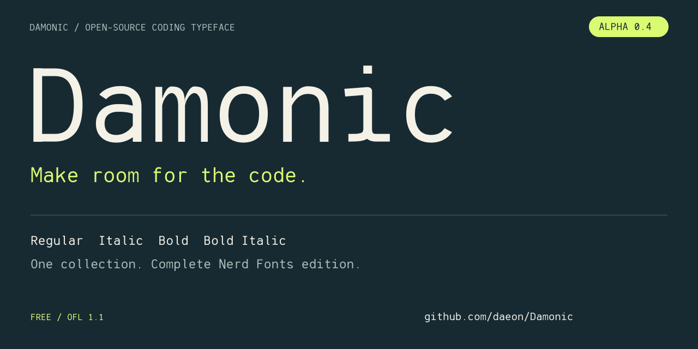

# Damonic



**Make room for the code.**

An original open-source coding typeface with four styles, a complete Nerd Fonts Mono edition, and one eight-face collection.

**[Download the free alpha](https://github.com/daeon/Damonic/releases/tag/v0.4.1-alpha)** · [Explore the marketing kit](marketing/README.md) · [View the specimen](marketing/assets/damonic-specimen.svg)

- **Your editor, your style:** Regular, Italic, Bold and Bold Italic.
- **Your terminal, with icons:** complete Nerd Fonts 3.5.1 mappings in the Mono edition.
- **Your setup, your choice:** optional operator ligatures, dotted zero and simple lowercase l.

> **Alpha 0.4.1:** ready for hands-on evaluation. Native-platform testing, hinting review and final optical polish remain before 1.0.

An original humanist monospace for coding and terminal work. **0.4.1 Alpha** develops the Bearing Mono 0.3.4 design under its new name, Damonic. Fira Code, Source Code Pro and Consolas informed the brief; their outlines were not used. This optical revision refines the narrow-letter rhythm; the original 0.4.0 engineering release preserved the 0.3.4 ASCII drawings.

## Install

`dist/Damonic.ttc` contains all eight faces in one file: Regular, Italic, Bold and Bold Italic in **Damonic** and **Damonic Nerd Font Mono**. Install the collection using your operating system font manager, then select the desired family in your editor or terminal. Restart the application after installation.

For an application that cannot use TTC, install the matching individual `.ttf` files instead. Avoid installing both copies at once. The Nerd family includes the complete mapped symbol repertoire of the pinned upstream Nerd Fonts Symbols Mono release. See `vendor/` and its provenance manifest for the exact version, mappings and hashes.

A TTC is a collection of discrete styles, not a variable font with continuous sliders. WOFF2 files are supplied for web use; the preview embeds the actual fonts.

## Features

- Four static styles, weights 400 and 700; 9-degree italic angle.
- A 600-unit cell on a 1000-unit em; zero-advance combining accents.
- Printable ASCII, Latin-1 Supplement, Latin Extended-A, useful punctuation, box drawing, blocks, Braille and Powerline. Greek and Cyrillic are not declared supported.
- Optional `dlig`: `-> <- => == != <= >=`, each retaining two cells. Off by default.
- `ss01`: dotted zero. `ss02`: simple lowercase l.
- Mark positioning and stacked accents; complex accent sequences still require visual review.

## Build

Use Python 3.11 or newer. The Python outline generator is the canonical editable source. Generated UFO files are interchange snapshots; edits to them are not consumed by the build. This avoids two divergent sources of truth.

```sh
python -m venv .venv
. .venv/bin/activate
python -m pip install -r requirements.txt
python release.py build
python tests/verify.py
python tests/soft_dots.py
python release.py package
```

On Windows activate with `.venv\Scripts\activate`. The source archive includes pinned symbol assets. A Git checkout downloads the pinned upstream archive on its first build and verifies its SHA-256 before use. The build uses `SOURCE_DATE_EPOCH=1788566400` unless overridden. Build twice in the same pinned environment and compare font/archive SHA-256 hashes.

For production reports, install `requirements-qa.txt` and run `python scripts/production_report.py`. It records the documented alpha exceptions and fails on unexpected errors.

`python release.py build` generates TTFs, the eight-face TTC, WOFF2, four UFO snapshots and the standalone preview. `package` produces binary and source ZIPs with normalized timestamps and a checksum manifest.

## Optical proofs

Run `python scripts/optical_proof.py --after dist --out docs/optical-proof.png` for the four-style, light/dark size matrix. Add `--before /path/to/previous/dist --overview docs/optical-overview.png` to compare versions. These are actual FreeType rasterizations; native-platform evaluation remains required. See `docs/OPTICAL-REVIEW.md` for the latest assessment.

## Status and contributing

This is an alpha, not a claim of complete professional polish. Read `RELEASE-PLAN.md`, `docs/ROADMAP.md` and the verification reports. Native Windows/macOS/Linux installation, editor and terminal behavior, high-DPI rendering and a sustained developer beta remain release gates. No manual hinting is claimed.

Report the version, OS, application, font family/style, size, display scaling and a minimal sample with a screenshot. For spacing reports, include both neighboring letters and a full word. See `CONTRIBUTING.md`.

## License

The original font software is licensed under SIL OFL 1.1 (`OFL.txt`), preserving the Bearing Mono attribution. No Reserved Font Name is declared for Damonic. Nerd Fonts symbols carry their upstream copyright and license notices in `licenses/` and the vendored asset notices. Redistribute those notices with the patched font.
